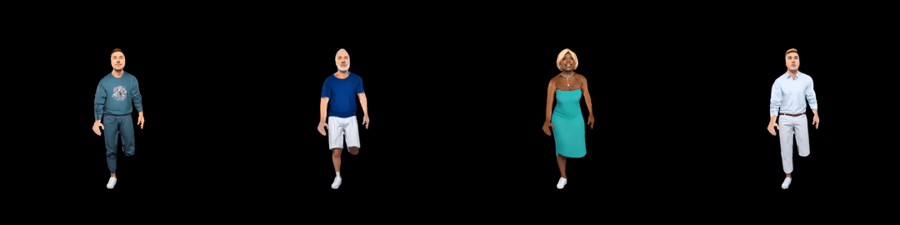
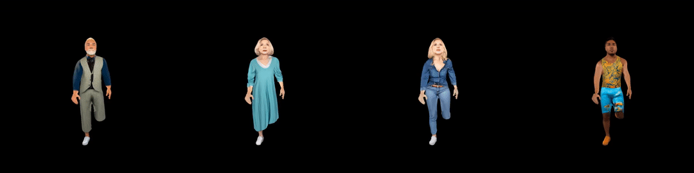

---
tasks:
- human3d-animation
model_type:
- 3D human animation
domain:
- cv
frameworks:
- pytorch
tags:
- Animated avatar
- 3D rigged human
- 角色绑定驱动
- 动态3D人物模型

license: Apache License 2.0


datasets:
  test:
  - damo/3DHuman_synthetic_dataset    
  - damo/3DHuman_action_dataset    
---

# 3DHuman-Syn三维角色驱动

### [论文](https://arxiv.org/abs/to-be-released) ｜ [项目主页](https://menyifang.github.io/projects/to-be-released.html)

输入选择的角色ID及动作ID，即可自动绑定驱动生成3D角色动画资产，输出可直接用于现有3D生产管线。

## 效果展示
3D角色驱动效果如下：





## 模型及功能描述

### 模型库描述

- 模型库包含1000个标准化的3D人物角色，呈标准姿态A字形分布；

- 每个实例模型采用triangular mesh结构，包含10w顶点、20w面片、以及2048*2048分辨率的纹理贴图；

- 人物范围涵盖男士、女士、老人、小孩等，服装涵盖各类日常服饰（如衬衫、西装、外套、裙装、牛仔服、休闲裤、紧身衣、风衣等）


### 功能描述

通过modelscope提供模型库中角色驱动功能

## 使用方法

### 环境安装
安装好基础modelscope环境后，安装nvdiffrast
```
# 安装nvdiffrast
git clone https://github.com/NVlabs/nvdiffrast.git
cd nvdiffrast
pip install .

# 安装nvdiffrast所需依赖（opengl等）
apt-get install freeglut3-dev
apt-get install binutils-gold g++ cmake libglew-dev mesa-common-dev build-essential libglew1.5-dev libglm-dev
apt-get install mesa-utils
apt-get install libegl1-mesa-dev 
apt-get install libgles2-mesa-dev
apt-get install libnvidia-gl-525
pip install 'numpy<=1.22.0' 'pandas<1.4.0' 
```
安装blender
```
wget 'https://vigen-invi.oss-cn-shanghai.aliyuncs.com/temp/qingyao/blender-3.1.2-linux-x64.tar.xz?OSSAccessKeyId=LTAI4GC5orxBm2gdjkBzmTqT&Expires=1702527307&Signature=In72Zd1gDt1pjol4l%2BaKIOaU1Z0%3D' -O blender-3.1.2-linux-x64.tar.xz
tar -xf blender-3.1.2-linux-x64.tar.xz
DIR=$(pwd)/blender-3.1.2-linux-x64
export PATH=$PATH:$DIR
```
验证：输入blender -b -P，打印版本即安装成功

### 3D角色驱动

在 ModelScope 框架上，通过简单的 pipeline 即可实现指定3D角色的驱动效果:

```python
from modelscope.pipelines import pipeline
from modelscope.utils.constant import Tasks
from modelscope.utils.test_utils import test_level


human3d = pipeline(Tasks.human3d_animation, model='damo/cv_3d-human-animation')
input = {'dataset_id': 'damo/3DHuman_synthetic_dataset',
         'case_id': '000039',
         'action_dataset': 'damo/3DHuman_action_dataset',
         'action': 'SwingDancing',
         'save_dir': 'human3d_results'}
output = human3d(input)
print('saved animation file to %s' % output)

print('finished')

```


### 模型局限性以及可能的偏差
当前驱动模型仅支持标准A姿态人体，后续可支持标准T姿态人体，自定义mesh输入需要先形变为标准姿态


## 引用
如果该模型对你有所帮助，请引用相关的论文：

```BibTeX
To be updated

```


